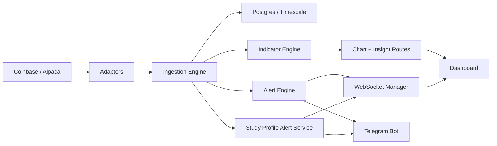

# Meridian

Meridian is a real-time market intelligence dashboard for stocks and crypto.

It streams live prices, backfills historical candles, computes technical indicators, scores market structure across multiple timeframes, and turns raw signals into a cleaner desk-style read with alerts, portfolios, and Telegram notifications.

## Why This Exists

Most trading side projects stop at a chart or a script.

Meridian is meant to feel closer to a lightweight market terminal:

- live crypto out of the box through Coinbase
- optional stock support through Alpaca now, with Schwab scaffolding in place
- warmed-up multi-timeframe charts instead of cold indicators
- plain-English signal interpretation instead of just raw numbers
- portfolio sleeves, alerting, and Telegram delivery in one workflow

## Core Features

- Live market ingestion over WebSockets
  - Coinbase public crypto feed
  - Alpaca equities feed when credentials are configured
- Historical candle backfill
  - Coinbase historical candles for crypto
  - Alpaca snapshot + bar fallback for equities
- Multi-timeframe charting
  - `1m`, `5m`, `15m`, `30m`, `1h`, `2h`, `4h`, `6h`, `12h`, `1d`, `2d`, `1w`
- Technical indicators
  - SMA, EMA, RSI, MACD, Bollinger Bands, VWAP
- Context-aware analysis
  - trend, momentum, volatility, participation, stretch
  - market regime detection
  - adaptive study-profile recommendations
  - timeframe matrix
  - AI-style market overview
- Alerts
  - classic threshold alerts
  - study-profile Telegram alerts that trigger when a selected profile turns constructive
- Portfolio workflows
  - multiple named portfolio profiles
  - per-asset allocation, strategy, and notes
- Browser dashboard
  - plain HTML/CSS/JS
  - live `/ws/stream` updates
  - terminal-inspired UI

## Product Snapshot

Meridian currently gives you:

- a live market board
- a chart workstation with price structure, overlays, indicator studies, and interpretation rail
- a multi-timeframe signal matrix
- a study-profile system that adapts by asset class, timeframe, and chart density
- Telegram delivery for both classic alerts and profile-based setups

## Architecture



## Stack

- FastAPI
- SQLAlchemy + asyncpg
- Postgres with TimescaleDB support when available
- WebSockets
- NumPy
- plain HTML, CSS, and JavaScript frontend

## Repo Layout

```text
meridian/
├── backend/
│   ├── adapters/      # Live market feed adapters
│   ├── db/            # DB engine + schema initialization
│   ├── engine/        # Ingestion and indicator processing
│   ├── indicators/    # Stateful indicator implementations
│   ├── routes/        # REST routes, dashboard route, websocket route
│   ├── services/      # Market-data clients, alerts, warmup, Telegram, Schwab scaffold
│   ├── static/        # Dashboard UI
│   ├── tests/         # Pytest coverage
│   └── websocket/     # Connection manager
├── docker-compose.yml
├── requirements.txt
└── README.md
```

## Quick Start

### 1. Create the environment file

```bash
cp .env.example .env
```

### 2. Choose a database path

Option A: Docker / TimescaleDB

```bash
docker compose up -d
```

Option B: Local Postgres

```bash
createdb meridian
```

Then set `DATABASE_URL` in `.env`, for example:

```env
DATABASE_URL=postgresql+asyncpg://YOUR_LOCAL_USERNAME@localhost:5432/meridian
```

Meridian will fall back to plain Postgres automatically if the TimescaleDB extension is not installed.

### 3. Start the app

```bash
uvicorn backend.main:app --reload
```

Open:

- Dashboard: [http://127.0.0.1:8000/dashboard](http://127.0.0.1:8000/dashboard)
- Docs: [http://127.0.0.1:8000/docs](http://127.0.0.1:8000/docs)

## Recommended Local Config

This is the most useful baseline `.env` shape for local development:

```env
DATABASE_URL=postgresql+asyncpg://YOUR_LOCAL_USERNAME@localhost:5432/meridian
REDIS_URL=redis://localhost:6379/0

ALPACA_API_KEY=
ALPACA_API_SECRET=
ALPACA_FEED=iex

SCHWAB_CLIENT_ID=
SCHWAB_CLIENT_SECRET=
SCHWAB_REDIRECT_URI=http://127.0.0.1:8765/schwab/callback
SCHWAB_SCOPE=
SCHWAB_TOKEN_PATH=.schwab_tokens.json

DEFAULT_SYMBOLS=["SPY","QQQ","IWM","DIA","AAPL","MSFT","NVDA","AMZN","META","TSLA"]
COINBASE_ENABLED=true
COINBASE_SYMBOLS=["BTC-USD","ETH-USD","SOL-USD"]

TELEGRAM_ENABLED=false
TELEGRAM_BOT_TOKEN=
TELEGRAM_CHAT_ID=

BATCH_INTERVAL_MS=100
HEARTBEAT_TIMEOUT_S=30
```

## Data Provider Setup

### Crypto

Coinbase is enabled by default, so Meridian can stream live crypto without extra credentials.

### Stocks

Alpaca is optional and only activates when these are set:

```env
ALPACA_API_KEY=your_key
ALPACA_API_SECRET=your_secret
ALPACA_FEED=iex
```

Meridian uses Alpaca for:

- live equity ingestion
- snapshot fallback for price cards
- historical bar fallback for stock charts

### Schwab

Schwab support is scaffolded but not finished end to end yet.

Once your app is approved, set:

```env
SCHWAB_CLIENT_ID=your_app_key
SCHWAB_CLIENT_SECRET=your_app_secret
SCHWAB_REDIRECT_URI=http://127.0.0.1:8765/schwab/callback
```

Useful routes:

- `GET /api/schwab/status`
- `GET /api/schwab/auth/url`
- `GET /api/schwab/auth/start`
- `GET /schwab/callback`

## Telegram Alerts

To enable Telegram delivery:

```env
TELEGRAM_ENABLED=true
TELEGRAM_BOT_TOKEN=your_bot_token
TELEGRAM_CHAT_ID=your_chat_id
```

Meridian can send:

- classic threshold alerts
- study-profile alerts from the chart workstation when a selected profile flips into a constructive state

## Main Endpoints

- `GET /` - service metadata
- `GET /api/health` - DB + feed status
- `GET /api/feeds/status` - per-feed connection info
- `GET /api/symbols` - available symbols with latest info
- `GET /api/prices/{symbol}` - latest price snapshot
- `GET /api/candles/{symbol}` - OHLCV candles
- `GET /api/charts/{symbol}` - chart payload with indicators and insights
- `GET /api/charts/{symbol}/matrix` - multi-timeframe matrix payload
- `GET /api/indicators/{symbol}` - latest indicators
- `GET /api/indicators/{symbol}/history` - indicator history
- `GET /api/alerts` - classic alerts
- `POST /api/alerts` - create classic alert
- `GET /api/profile-alerts` - study-profile Telegram alerts
- `POST /api/profile-alerts` - create study-profile alert
- `GET /api/portfolios` - list portfolio profiles
- `POST /api/portfolios` - create portfolio profile
- `GET /dashboard` - main dashboard
- `WS /ws/stream` - live market and alert stream

## Dashboard Walkthrough

The dashboard is organized into four tabs:

- `Overview`
  - live market board
  - feed status
  - recent triggers
- `Charts`
  - price chart
  - timeframe matrix
  - adaptive study profiles
  - interpretation rail
  - indicator studies
- `Portfolios`
  - create named sleeves
  - add assets, allocation, and notes
- `Alerts`
  - create classic threshold alerts
  - review triggered alerts

## Testing

Run the full backend suite with:

```bash
pytest backend/tests -q
```

## Current Status

What is solid today:

- live crypto demo path
- multi-timeframe charting
- crypto history backfill
- portfolio workflow
- Telegram alerting
- adaptive study-profile system

What is still in progress:

- fully wired Schwab market-data integration
- stock experience parity once Schwab is approved
- continued frontend polish and modularization

## Resume-Friendly Summary

Meridian is a strong fintech project because it combines:

- real-time market data ingestion
- time-series storage
- technical analysis
- websocket streaming
- alerting and notifications
- user-facing product design

In other words, it is not just a model or a chart. It is a small market platform.
